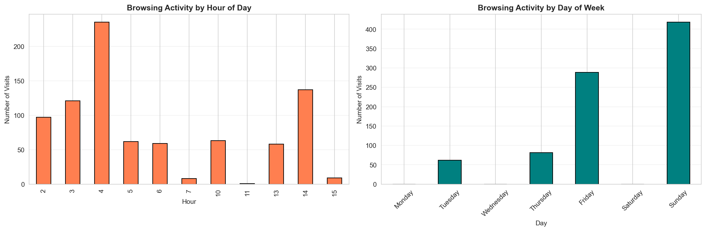

# ⏱️ Time-Based Browsing Pattern Analyzer
 
### Deep Learning + RAM Usage Correlation for User Behavior Analytics
 


 
---
 
## 📌 Project Overview
 
This project analyzes **personal browsing history** combined with **system RAM usage** to uncover meaningful behavioral patterns using Deep Learning and Machine Learning techniques.
 
The main goal is to understand how different types of online activities impact **system resource consumption** and to classify user behavior into meaningful categories such as **productive** or **non-productive**.
 
> Built as a complete **data science + machine learning pipeline** — from raw browser logs to behavioral insights, anomaly detection, and visualizations.
 
---
 
## 🎯 Objectives
 
| Goal | Description |
|------|-------------|
| ⏰ Time Pattern Analysis | Understand browsing habits across hours and days |
| 🤖 Behavior Clustering | Group similar sessions using unsupervised ML |
| ⚠️ Anomaly Detection | Identify unusual browsing sessions via Autoencoder |
| 💾 RAM Correlation | Link system memory usage to browsing activity |
| 📊 Visual Insights | Deliver clear, actionable behavioral analytics |
 
---
 
## 🔍 What This Project Does
 
- ⏰ Extracts **time-based browsing patterns** (hour/day trends)
- 🌐 Identifies **frequently visited domains** and their categories
- 📊 Creates **browsing sessions** from raw history logs
- 🤖 Applies **KMeans clustering** for unsupervised behavior grouping
- ⚠️ Detects **anomalous sessions** using a Deep Learning Autoencoder
- 💾 Correlates **RAM usage** with browsing category and activity
- 📈 Generates **visual insights** and productivity recommendations
---
 
## 🛠️ Tech Stack
 
| Category | Tools |
|----------|-------|
| Language | Python 3.8+ |
| Data Processing | Pandas, NumPy |
| Visualization | Matplotlib, Seaborn |
| Machine Learning | Scikit-learn (KMeans) |
| Deep Learning | TensorFlow, Keras (Autoencoder) |
| System Monitoring | psutil |
| Environment | Jupyter Notebook |
 
---
 
## 📁 Project Structure
 
```
Time-Based-Browsing-Pattern-Analyzer/
│
├── browsing_pattern_analyzer_custom.ipynb   # Main notebook — full pipeline
├── autoencoder_model.h5                     # Saved Autoencoder model
│
├── anomalous_sessions.csv                   # Detected anomalous sessions
├── cluster_profiles.csv                     # KMeans cluster summaries
├── domain_category_map.csv                  # Domain → Category mapping
├── ram_by_category.csv                      # RAM usage aggregated by category
├── ram_log.csv                              # Raw RAM usage logs
├── recommendations.csv                      # Generated behavior recommendations
├── session_features_complete.csv            # Engineered session-level features
│
├── time_patterns.png                        # Visualization output
└── README.md                                # Project documentation
```
 
---
 
## 🔄 Project Workflow
 
```
Browser History Logs + RAM Logs (psutil)
              ↓
     Data Loading & Cleaning
              ↓
   Feature Engineering & Sessionization
              ↓
  Exploratory Data Analysis (EDA)
              ↓
     ┌────────────────────────┐
     │  KMeans Clustering     │  → cluster_profiles.csv
     │  Autoencoder (DL)      │  → anomalous_sessions.csv
     └────────────────────────┘
              ↓
   RAM Usage Correlation Analysis
              ↓
  Visualizations & Recommendations
              ↓
     Behavioral Insights & Reports
```
 
---
 
## 🧠 Notebook Workflow — Step by Step
 
### 1️⃣ Data Loading
- Load **Chrome/browser history** dataset
- Load **RAM usage logs** captured via `psutil`
---
 
### 2️⃣ Data Preprocessing
 
| Task | Details |
|------|---------|
| URL Cleaning | Strip query params, normalize URLs |
| Domain Extraction | Extract root domains from full URLs |
| Missing Values | Handle null timestamps and empty fields |
| Timestamp Formatting | Convert to datetime for time-based analysis |
 
---
 
### 3️⃣ Feature Engineering
 
**⏰ Time-Based Features:**
 
| Feature | Description |
|---------|-------------|
| `hour_of_day` | Hour when browsing occurred |
| `day_of_week` | Day (Mon–Sun) of activity |
| `visit_frequency` | Number of visits per domain |
| `session_duration` | Time gap between consecutive visits |
| `category` | Domain mapped to category (Work, Social, Entertainment, etc.) |
 
---
 
### 4️⃣ Sessionization
 
- Converts raw browsing logs into **user sessions**
- Groups activity based on **time gaps** (e.g., 30-minute inactivity = new session)
- Output: `session_features_complete.csv`
---
 
### 5️⃣ Exploratory Data Analysis (EDA)
 
Analyses performed:
 
- 📈 Browsing frequency by hour and day
- 🌐 Top visited domains and categories
- 📊 Session duration distribution
- 💾 RAM usage over time
- 🔗 Correlation heatmap (browsing features vs RAM)
---
 
### 6️⃣ Machine Learning — KMeans Clustering
 
- Groups browsing sessions into **behavioral clusters**
- Each cluster represents a distinct usage pattern
| Cluster | Profile |
|---------|---------|
| 🟢 Cluster 0 | Productive — Work, research, documentation |
| 🔵 Cluster 1 | Neutral — Mixed browsing, moderate RAM |
| 🔴 Cluster 2 | Non-Productive — Social media, entertainment, high RAM |
 
> Output: `cluster_profiles.csv`
 
---
 
### 7️⃣ Deep Learning — Autoencoder (Anomaly Detection)
 
**Model:** `autoencoder_model.h5`
 
| Component | Details |
|-----------|---------|
| Architecture | Encoder → Bottleneck → Decoder |
| Input | Session feature vectors |
| Training | Learns normal browsing patterns |
| Detection | High reconstruction error = Anomaly |
| Threshold | Tuned using percentile-based cutoff |
 
> Sessions with reconstruction error above the threshold are flagged as anomalous.
> Output: `anomalous_sessions.csv`
 
---
 
### 8️⃣ RAM Usage Correlation Analysis
 
- Merges **browsing session data** with **RAM logs** (`ram_log.csv`)
- Aggregates RAM consumption per browsing category (`ram_by_category.csv`)
| Insight | Finding |
|---------|---------|
| 🎬 Streaming sites | Highest RAM consumption |
| 💼 Work/Docs sites | Moderate, stable RAM usage |
| 🐦 Social media | High RAM with frequent tab switching |
| 📰 News sites | Low RAM, short session duration |
 
---
 
### 9️⃣ Visualization & Insights
 
Outputs include:
- ⏱️ Time-based activity heatmaps (`time_patterns.png`)
- 🔵 KMeans cluster scatter plots
- 📊 RAM usage bar charts by category
- ⚠️ Anomaly score distribution plots
- 🤝 Browsing vs RAM correlation charts
---
 
## 📊 Key Output Files
 
| File | Description |
|------|-------------|
| `session_features_complete.csv` | Full engineered session dataset |
| `cluster_profiles.csv` | KMeans cluster summaries |
| `anomalous_sessions.csv` | Sessions flagged as anomalies |
| `domain_category_map.csv` | Domain to category mapping |
| `ram_by_category.csv` | RAM usage grouped by browsing category |
| `ram_log.csv` | Raw system RAM usage logs |
| `recommendations.csv` | Personalized productivity recommendations |
| `autoencoder_model.h5` | Saved trained Autoencoder model |
| `time_patterns.png` | Time-based browsing visualization |
 
---
 
## 🖼️ Visualization Output
 

 
> Additional plots are generated inline within the notebook.
 
---
 
## 🚀 How to Run
 
### 1. Clone the Repository
 
```bash
git clone https://github.com/Prem04-kumar/Time-Based-Browsing-Pattern-Analyzer-using-Deep-Learning-with-RAM-Usage-Correlation.git
cd Time-Based-Browsing-Pattern-Analyzer-using-Deep-Learning-with-RAM-Usage-Correlation
```
 
### 2. Install Dependencies
 
```bash
pip install pandas numpy matplotlib seaborn scikit-learn tensorflow keras psutil jupyter
```
 
### 3. Launch the Notebook
 
```bash
jupyter notebook browsing_pattern_analyzer_custom.ipynb
```
 
### 4. Run All Cells
 
Execute the notebook from top to bottom — all outputs, CSVs, and visualizations will be generated automatically.
 
---
 
## 💡 Use Cases
 
| Domain | Application |
|--------|-------------|
| 🧑‍💻 Personal Productivity | Identify productive vs non-productive browsing habits |
| 🏢 Enterprise Monitoring | Track employee browsing patterns and resource usage |
| 🔐 Cybersecurity | Detect anomalous browsing that may indicate a threat |
| 💻 System Optimization | Identify which browsing categories drain RAM |
| 🎓 Digital Wellbeing | Promote healthier and more focused internet use |
 
---
 
## 🌐 Future Enhancements
 
- [ ] 🚀 Deploy as a **Streamlit dashboard** for real-time monitoring
- [ ] 🔄 Build a **live RAM + browser log collector** using `psutil`
- [ ] 🧠 Replace KMeans with **DBSCAN** for density-based clustering
- [ ] 📱 Browser **extension** for continuous data collection
- [ ] 📊 Add **LSTM** for time-series browsing prediction
- [ ] 🔔 Alert system for **anomalous behavior notifications**
- [ ] 🌍 Multi-user support with **user-level profiles**
---
 
## 📚 Key Learnings
 
- ✅ Browser history parsing and URL feature extraction
- ✅ Time-series sessionization from raw logs
- ✅ Unsupervised learning with KMeans clustering
- ✅ Autoencoder-based anomaly detection (Deep Learning)
- ✅ System resource monitoring using `psutil`
- ✅ RAM-browsing correlation analysis
- ✅ End-to-end data science pipeline design
- ✅ Behavioral analytics and recommendation generation
---
 
## 👨‍💻 Author
 
**Prem Kumar A**
 
[](https://github.com/Prem04-kumar)
[](https://www.linkedin.com/in/)
 
> 📁 Project Type: **Deep Learning | Behavioral Analytics | System Monitoring | End-to-End Pipeline**
 
---
 
## 📌 Conclusion
 
This project demonstrates how **browsing history and system RAM data** can be combined to uncover meaningful insights about user productivity and digital behavior.
 
| Pillar | Contribution |
|--------|-------------|
| 🤖 Deep Learning | Autoencoder for unsupervised anomaly detection |
| 🔵 Machine Learning | KMeans clustering for behavior segmentation |
| 💾 System Analytics | RAM correlation with browsing categories |
| 📊 Visualization | Time patterns, clusters, and RAM trends |
| 💡 Recommendations | Actionable productivity insights per user cluster |
 
> By combining **behavioral data** with **system resource monitoring**, this project offers a unique lens into how people interact with the web — and what that means for their productivity and system performance.
 
---
 
> ⭐ **If you found this project helpful, please give it a star on GitHub!**
 


